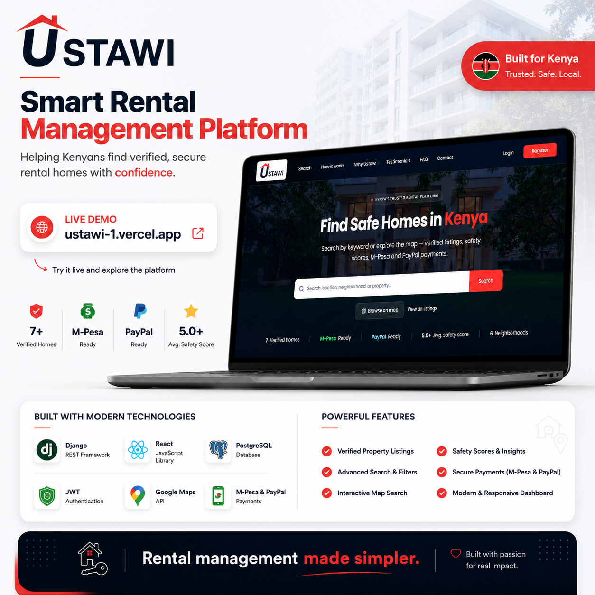

# Ustawi

**Find safe homes. Rent with confidence. Thrive where you live.**

[](https://ustawi-1.vercel.app)

Ustawi is a verified rental and housing platform (PropTech) built for Nairobi and Kenya's broader housing market. It helps tenants find safe, verified homes while giving landlords and agents reliable tools for property management, tenant screening, and rent collection.

This repository contains the full-stack Ustawi platform. **All 11 backend phases are complete.** The Next.js frontend is next — built page-by-page against the wireframes and API endpoints below.

---

## Table of Contents

- [Core Value Proposition](#core-value-proposition)
- [Platform Modules](#platform-modules)
- [Technology Stack](#technology-stack)
- [Repository Structure](#repository-structure)
- [Backend (Phases 1–11 — Complete)](#backend-phases-111--complete)
- [Frontend (Planned)](#frontend-planned)
- [Development Phases Roadmap](#development-phases-roadmap)
- [Getting Started](#getting-started)
- [Environment Variables](#environment-variables)
- [API Reference](#api-reference)
- [Docker Workflow](#docker-workflow)
- [Deployment](#deployment)
- [Security & Compliance](#security--compliance)
- [Contributing](#contributing)

---

## Core Value Proposition

| Pillar | Description |
|--------|-------------|
| **Trust** | Verified listings, safety scores, inspector workflows, and community reporting |
| **Safety** | AI-assisted safety scoring, document verification, and dispute resolution |
| **Transparency** | Clear pricing, landlord profiles, lease documents, and payment receipts |
| **Local-first** | M-Pesa payments, Kenyan phone OTP (+254), Nairobi-centric locations |

---

## Platform Modules

| Module | Description | Status |
|--------|-------------|--------|
| Homepage & Search | Map-based search, filters (price, safety, amenities), featured listings | Backend ✅ · Frontend pending |
| Property Listings | Photos, documents, safety scores, virtual tours | Backend ✅ · Frontend pending |
| Tenant Portal | Applications, leases, M-Pesa rent, maintenance, dashboard | Backend ✅ · Frontend pending |
| Landlord / Agent Portal | Property CRUD, application inbox, analytics, billing | Backend ✅ · Frontend pending |
| Inspector / Admin | Verification queue, safety scoring, platform management | Backend ✅ · Frontend pending |
| Community & Insights | Utility reports, forums, safety alerts | Post-MVP |
| Blog / Resources | Tenant rights, market trends, maintenance tips | Post-MVP |

---

## Technology Stack

### Backend (current)

| Layer | Technology |
|-------|-------------|
| Framework | Django 5.x + Django REST Framework |
| Auth | JWT (`djangorestframework-simplejwt`) + token blacklist |
| Database | PostgreSQL + PostGIS (geo search) |
| Cache / Queue | Redis + Celery (notifications, M-Pesa callbacks) |
| API Docs | drf-spectacular (OpenAPI 3 / Swagger) |
| SMS / OTP | Africa's Talking |
| File Storage | Local (dev) → S3 / Cloudinary (production) |
| Deploy target | Render |

### Frontend (planned)

| Layer | Technology |
|-------|-------------|
| Framework | Next.js 15 (App Router) |
| Styling | Tailwind CSS + Shadcn/ui + Radix UI |
| State | TanStack Query (React Query) |
| Forms | React Hook Form + Zod |
| Maps | Mapbox GL JS or Leaflet |
| Real-time | WebSockets / polling (Phase 8+) |
| Deploy target | Vercel |

### Design Language

Inspired by Nenasasa: **navy hero sections**, **red accent CTAs**, generous whitespace, mobile-first responsive layout.

---

## Repository Structure

```
ustawi/
├── backend/                    # Django REST API
│   ├── config/                 # Settings (dev / staging / prod), URLs, WSGI
│   ├── core/                   # Shared utilities, RBAC, pagination, health check
│   ├── apps/
│   │   ├── accounts/           # Users, auth, profiles, privacy
│   │   ├── properties/         # Listings, search, PostGIS, media
│   │   ├── applications/       # Rental applications, screening
│   │   ├── verification/       # Inspector queue, safety scores
│   │   ├── leases/             # Digital leases, signatures
│   │   ├── payments/           # M-Pesa, invoices, receipts
│   │   ├── maintenance/        # Maintenance requests
│   │   ├── notifications/      # In-app, email, SMS alerts
│   │   ├── support/            # Disputes, knowledge base, live chat
│   │   └── analytics/          # Dashboard KPIs, charts, recommendations
│   ├── docs/                   # PRODUCTION.md, Postman collection
│   ├── requirements/           # base.txt, dev.txt, prod.txt
│   ├── Dockerfile
│   ├── manage.py
│   └── .env.example            # Copy to .env — never commit .env
├── frontend/                   # Next.js app (not yet started)
├── docker-compose.yml          # PostGIS + Redis + Django web
├── .github/workflows/          # CI (lint, test, migrate check)
├── render.yaml                 # Render deployment blueprint
├── images/                     # Wireframes & sample assets (gitignored for now)
└── README.md
```

---

## Backend (Phases 1–11 — Complete)

### Phase summary

| Phase | Focus | Status |
|-------|--------|--------|
| 1 | Foundation & Authentication | ✅ Complete |
| 2 | Properties, Media & Search | ✅ Complete |
| 3 | Rental Applications & Screening | ✅ Complete |
| 4 | Verification & Safety Scoring | ✅ Complete |
| 5 | Leases & Document Management | ✅ Complete |
| 6 | Payments & Billing (M-Pesa) | ✅ Complete |
| 7 | Maintenance Requests | ✅ Complete |
| 8 | Notifications & Activity Feed | ✅ Complete |
| 9 | Support & Disputes | ✅ Complete |
| 10 | Analytics & Dashboard APIs | ✅ Complete |
| 11 | Production Hardening & Render Deploy | ✅ Complete |

### What's implemented

**Phase 1 — Auth & profiles**
- Custom User model (UUID, email login, Kenyan phone, roles)
- Multi-step registration with phone OTP (Africa's Talking + dev fallback)
- JWT auth with refresh rotation, blacklist, password reset
- RBAC (`IsTenant`, `IsLandlord`, `IsInspector`, `IsAdmin`)
- Login activity logging, notification preferences

**Phase 2 — Properties**
- Property CRUD, gallery images, amenities, neighborhoods
- Public search with filters, geo radius/bbox (PostGIS), featured listings
- Landlord property management, saved properties
- Redis caching on search, featured, and filter metadata

**Phase 3 — Applications**
- Tenant rental applications with documents and screening score
- Landlord application inbox, approve/reject workflow

**Phase 4 — Verification**
- Inspector verification queue, safety scoring, approve/reject
- Community reports, admin pipeline stats
- Auto-creates verification case on property publish

**Phase 5 — Leases**
- Digital lease lifecycle, documents, addenda, e-signatures
- Auto-create lease on application approval → property occupied

**Phase 6 — Payments**
- Invoices, M-Pesa Daraja STK Push (dev-mode simulation)
- Payment receipts, landlord billing, Celery callback processing

**Phase 7 — Maintenance**
- Tenant maintenance requests with photos, landlord assignment workflow

**Phase 8 — Notifications**
- In-app notifications, activity feed, channel dispatch (email/SMS stubs)
- Triggers wired across applications, payments, maintenance, leases

**Phase 9 — Support**
- Support cases, attachments, messaging, knowledge base, live chat
- Admin support management

**Phase 10 — Analytics**
- Tenant, landlord, and admin dashboard APIs (KPIs + chart data)
- Time-series chart endpoints, property recommendation engine

**Phase 11 — Production hardening**
- DRF rate limiting, CORS/CSRF for Vercel, security headers
- Upload validation (Pillow + PDF checks)
- Kenya DPA: data export + account deletion endpoints
- Structured JSON logging, Sentry integration, Redis caching
- `render.yaml` (web + worker + Postgres + Redis), GitHub Actions CI
- Production docs + Postman collection

### Backend apps

| App | Phase | Purpose |
|-----|-------|---------|
| `accounts` | 1, 11 ✅ | Users, auth, profiles, privacy |
| `properties` | 2 ✅ | Listings, search, PostGIS, media |
| `applications` | 3 ✅ | Rental applications, screening |
| `verification` | 4 ✅ | Inspector queue, safety scores |
| `leases` | 5 ✅ | Digital leases, documents |
| `payments` | 6 ✅ | M-Pesa, invoices, receipts |
| `maintenance` | 7 ✅ | Maintenance requests |
| `notifications` | 8 ✅ | In-app, email, SMS alerts |
| `support` | 9 ✅ | Disputes, knowledge base |
| `analytics` | 10 ✅ | Dashboard KPIs, charts |

---

## Frontend (Next)

The frontend will be a **Next.js 15** application deployed on **Vercel**, consuming the Django REST API at `/api/v1/`.

### Wireframe pages (~21)

| # | Page | Primary role |
|---|------|--------------|
| 1 | Homepage | Public |
| 2 | Login | All |
| 3 | Registration (multi-step + OTP) | All |
| 4 | Property search | Public / Tenant |
| 5 | Property detail | Public / Tenant |
| 6 | Search empty state | Public |
| 7 | Tenant dashboard | Tenant |
| 8 | My applications | Tenant |
| 9 | Application success | Tenant |
| 10 | Leases & contracts | Tenant |
| 11 | Payments & billing | Tenant / Landlord |
| 12 | Payment success | Tenant |
| 13 | Maintenance requests | Tenant |
| 14 | Profile & settings | All |
| 15 | Notifications center | All |
| 16 | Landlord dashboard | Landlord |
| 17 | My properties | Landlord |
| 18 | Tenant application inbox | Landlord |
| 19 | Admin dashboard | Admin |
| 20 | Property verification portal | Inspector |
| 21 | Support / dispute center | All |

Wireframes live in `images/` (gitignored until ready for the repo).

---

## Development Phases Roadmap

All backend phases are complete. Frontend development is next.

| Track | Status |
|-------|--------|
| Backend (Phases 1–11) | ✅ Complete |
| Frontend (Next.js 15) | 🔜 Next |
| Render deploy | Blueprint ready — connect when ready |
| Vercel deploy | After frontend scaffold |

---

## Getting Started

### Prerequisites

- **Python 3.12+** (3.14 works for local dev)
- **Docker Desktop** (recommended — provides PostGIS + Redis)
- **Git**

### Option A — Docker (recommended)

Requires Docker Desktop running.

```bash
# From project root
cp backend/.env.example backend/.env   # edit if needed

docker compose up --build              # first time only — use --build
# API: http://localhost:8000/api/docs/
```

> **Note:** First build downloads ~1 GB of GDAL/PostGIS dependencies and can take 15–30 minutes. Subsequent starts use `docker compose up` (no `--build`).

### Option B — Local development (Windows / no Docker)

For quick auth testing without PostGIS:

```bash
cd backend
cp .env.example .env
```

Set in `.env`:

```env
USE_POSTGIS=false
USE_SQLITE=true
```

Then:

```bash
pip install -r requirements/dev.txt
python manage.py migrate
python manage.py runserver 8001
# API: http://localhost:8001/api/docs/
```

> Use port **8001** if another Django project occupies **8000**.

### Create a superuser

**Docker:**

```bash
docker compose exec web python manage.py createsuperuser
```

**Local:**

```bash
cd backend
python manage.py createsuperuser
```

Admin panel: `http://localhost:8000/admin/` (Docker) or `http://localhost:8001/admin/` (local).

---

## Environment Variables

Copy `backend/.env.example` to `backend/.env`. **Never commit `.env`.**

| Variable | Description | Default |
|----------|-------------|---------|
| `SECRET_KEY` | Django secret key | — |
| `DEBUG` | Debug mode | `True` (dev) |
| `ALLOWED_HOSTS` | Comma-separated hosts | `localhost,127.0.0.1` |
| `USE_POSTGIS` | Enable PostGIS engine | `true` (Docker) |
| `USE_SQLITE` | SQLite fallback (dev only) | `false` |
| `DATABASE_URL` | Database connection string | See `.env.example` |
| `REDIS_URL` | Redis cache URL | `redis://localhost:6379/0` |
| `CORS_ALLOWED_ORIGINS` | Frontend origins (Vercel) | `http://localhost:3000` |
| `CSRF_TRUSTED_ORIGINS` | Trusted CSRF origins | Same as CORS |
| `JWT_ACCESS_TOKEN_LIFETIME_MINUTES` | Access token TTL | `60` |
| `JWT_REFRESH_TOKEN_LIFETIME_DAYS` | Refresh token TTL | `7` |
| `AFRICAS_TALKING_USERNAME` | SMS API username | blank = dev OTP mode |
| `AFRICAS_TALKING_API_KEY` | SMS API key | blank = dev OTP mode |
| `AFRICAS_TALKING_SENDER_ID` | SMS sender ID | `USTAWI` |
| `OTP_LENGTH` | OTP digit count | `6` |
| `OTP_EXPIRY_MINUTES` | OTP validity | `10` |
| `FRONTEND_PASSWORD_RESET_URL` | Reset link base URL | `http://localhost:3000/reset-password` |
| `SENTRY_DSN` | Error monitoring (production) | blank |
| `MPESA_CONSUMER_KEY` | M-Pesa Daraja credentials | blank = dev simulation |

See `backend/docs/PRODUCTION.md` for the full production variable list.

### Dev OTP mode

When Africa's Talking credentials are blank, OTP codes are logged to the console and returned as `dev_otp` in the registration API response. **Disable this in production.**

---

## API Reference

Base URL: `http://localhost:8000` (Docker) or `http://localhost:8001` (local)

Interactive docs: **`/api/docs/`** · Postman: **`backend/docs/postman/Ustawi-API.postman_collection.json`**

> The API spans all 11 backend phases. Use Swagger for the full endpoint list grouped by tag (Properties, Leases, Payments, Analytics, etc.).

### Health

| Method | Endpoint | Auth | Description |
|--------|----------|------|-------------|
| GET | `/api/health/` | None | Service, database, and cache health |

### Authentication

| Method | Endpoint | Auth | Description |
|--------|----------|------|-------------|
| POST | `/api/v1/auth/register/role/` | None | Step 1 — select role |
| POST | `/api/v1/auth/register/profile/` | None | Step 2 — profile + credentials |
| POST | `/api/v1/auth/register/send-otp/` | None | Step 3 — send phone OTP |
| POST | `/api/v1/auth/register/verify/` | None | Step 4 — verify OTP, create account |
| POST | `/api/v1/auth/login/` | None | Login, returns JWT |
| POST | `/api/v1/auth/logout/` | Bearer | Blacklist refresh token |
| POST | `/api/v1/auth/refresh/` | None | Refresh access token |
| GET | `/api/v1/auth/me/` | Bearer | Current user |
| POST | `/api/v1/auth/password-reset/` | None | Request reset email |
| POST | `/api/v1/auth/password-reset/confirm/` | None | Confirm password reset |

### Profile

| Method | Endpoint | Auth | Description |
|--------|----------|------|-------------|
| GET | `/api/v1/profile/` | Bearer | Get profile |
| PATCH | `/api/v1/profile/` | Bearer | Update profile |
| GET | `/api/v1/profile/notifications/` | Bearer | Notification preferences |
| PATCH | `/api/v1/profile/notifications/` | Bearer | Update preferences |
| GET | `/api/v1/profile/login-activity/` | Bearer | Login history (last 20) |
| GET | `/api/v1/profile/data-export/` | Bearer | Export personal data (Kenya DPA) |
| POST | `/api/v1/profile/delete-account/` | Bearer | Delete / anonymize account |

### Registration flow example

```bash
# 1. Select role
POST /api/v1/auth/register/role/
{ "role": "TENANT" }
# → registration_token

# 2. Submit profile
POST /api/v1/auth/register/profile/
{
  "registration_token": "<uuid>",
  "email": "tenant@example.com",
  "password": "SecurePass123!",
  "password_confirm": "SecurePass123!",
  "full_name": "Jane Doe",
  "phone": "0712345678"
}

# 3. Send OTP
POST /api/v1/auth/register/send-otp/
{ "registration_token": "<uuid>" }
# → dev_otp (development only)

# 4. Verify & create account
POST /api/v1/auth/register/verify/
{
  "registration_token": "<uuid>",
  "otp": "123456"
}
# → user + JWT tokens
```

### Response format

**Success:**

```json
{
  "success": true,
  "message": "Optional message",
  "data": { }
}
```

**Error:**

```json
{
  "success": false,
  "error": {
    "code": 400,
    "message": "Human-readable message",
    "details": { }
  }
}
```

**Paginated lists:**

```json
{
  "success": true,
  "count": 100,
  "next": "…",
  "previous": null,
  "results": []
}
```

---

## Docker Workflow

| Task | Command |
|------|---------|
| First start (build) | `docker compose up --build` |
| Daily start | `docker compose up` |
| Start in background | `docker compose up -d` |
| Stop | `docker compose down` |
| Stop + wipe DB | `docker compose down -v` ⚠️ |
| Run migrations | `docker compose exec web python manage.py migrate` |
| Create superuser | `docker compose exec web python manage.py createsuperuser` |
| View logs | `docker compose logs -f web` |

You **do not** need `--build` on every restart — only when `Dockerfile` or `requirements/` change.

---

## Deployment

| Service | Provider | URL |
|---------|----------|-----|
| Backend API | Render | `render.yaml` blueprint included |
| Frontend | Vercel | Planned (Next.js) |
| Database | Render PostgreSQL + PostGIS | Via `render.yaml` |
| Redis | Render Redis | Link in Render dashboard |
| Domain | ustawikenya.com / .co.ke | Planned |

### Render checklist

See **`backend/docs/PRODUCTION.md`** for the full deployment guide.

1. Connect GitHub repo to Render
2. Apply `render.yaml` (web + Celery worker + Postgres + Redis)
3. Set `ALLOWED_HOSTS`, `CORS_ALLOWED_ORIGINS`, `CSRF_TRUSTED_ORIGINS` for your Vercel domain
4. Set environment variables from `.env.example`
5. Set `DJANGO_SETTINGS_MODULE=config.settings.production`
6. Health check path: `/api/health/`

---

## Security & Compliance

- JWT with refresh token rotation and blacklist on logout
- Role-based access control (RBAC) on all protected endpoints
- DRF rate limiting (stricter on auth/OTP endpoints)
- Password validation (min 8 chars, Django validators)
- Phone verification via OTP before account activation
- Login activity audit trail (IP, location, user agent)
- CORS + CSRF restricted to configured frontend origins
- Security headers (HSTS, `X-Frame-Options`, `Referrer-Policy`)
- Upload validation (Pillow image + PDF magic-byte checks)
- Kenya Data Protection Act — data export and account deletion endpoints
- Structured JSON logging and Sentry integration (production)

---

## External Integrations

| Service | Purpose | Status |
|---------|---------|--------|
| M-Pesa Daraja | Rent payments (STK Push) | ✅ Backend (dev simulation without credentials) |
| Africa's Talking | SMS / OTP | ✅ Integrated (console fallback in dev) |
| Mapbox / Google Maps | Property maps | Frontend |
| Resend / AWS SES | Transactional email | ✅ Console backend in dev |
| S3 / Cloudinary | Property photos & documents | Env stubs ready |
| Sentry | Error monitoring | ✅ Integrated (set `SENTRY_DSN`) |
| Firebase / FCM | Push notifications | Post-MVP |

---

## Contributing

Backend phases 1–11 are complete. Frontend contributions welcome.

1. Fork / branch from `main`
2. Follow existing code conventions in `backend/` and `frontend/`
3. Never commit `.env` or secrets
4. Run `ruff check .`, `python manage.py test`, and verify via `/api/docs/` before opening a PR

---

## License

Proprietary — Ustawi Kenya. All rights reserved.

---

## Contact

**Product:** Ustawi — Verified Rental & Housing Platform  
**Market:** Nairobi, Kenya → East Africa
